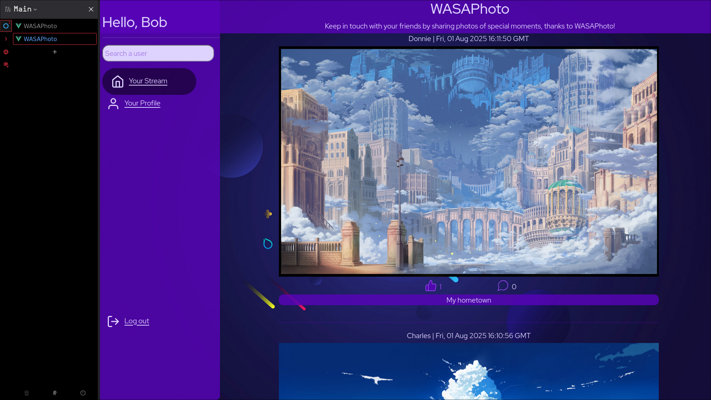
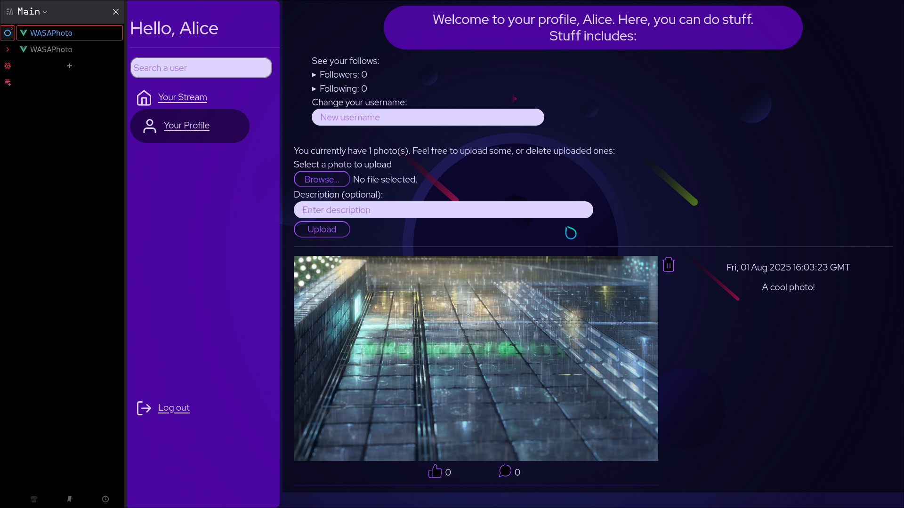
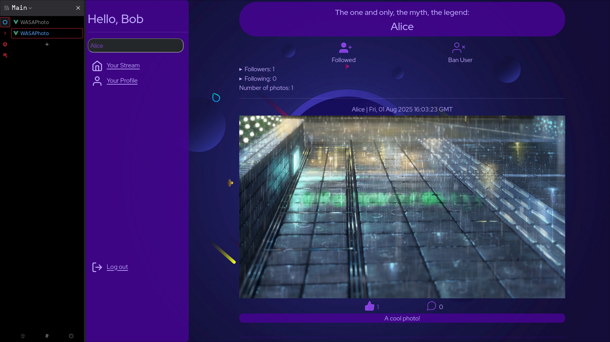
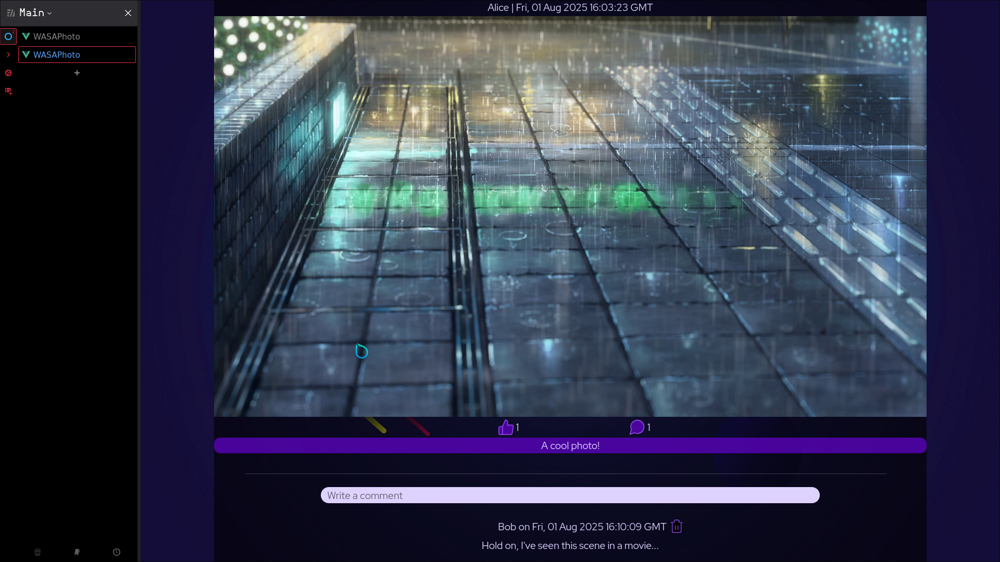

# WASAPhoto

## Specifications

The WASAPhoto project for the WASA class of 2023-2024 consists in creating a social network that allows users to see pictures
of other users and upload their own. It is subdivided in of 4 homeworks, one for each phase of the development (API specification,
backend, frontend and dockers). The design specifications are as follows:

Each user will be presented with a stream of photos (images) in reverse chronological order, with
information about when each photo was uploaded (date and time) and how many likes and comments
it has. The stream is composed by photos from “following” (other users that the user follows). Users
can place (and later remove) a “like” to photos from other users. Also, users can add comments to any
image (even those uploaded by themself). Only authors can remove their comments.
Users can ban other users. If user Alice bans user Eve, Eve won’t be able to see any information about
Alice. Alice can decide to remove the ban at any moment.
Users will have their profiles. The personal profile page for the user shows: the user’s photos (in reverse
chronological order), how many photos have been uploaded, and the user’s followers and following.
Users can change their usernames, upload photos, remove photos, and follow/unfollow other users.
Removal of an image will also remove likes and comments.
A user can search other user profiles via username.
A user can log in just by specifying the username.

## Quick start

The easiest way is through docker containers, and since we'll need both the frontend and the backend
we'll need two terminal windows, both in the project's root directory:

In the first window, build and then run the backend server with:

```sh
docker build -f Dockerfile.backend -t backend .
docker run -it --rm -p 3000:3000 backend
```

Now the backend server is up and listening to requests.
In the second window, start the frontend with:

```sh
docker build -f Dockerfile.frontend -t frontend .
docker run -it --rm -p 8080:80 frontend
```

**Now entering the address <http://localhost:8080> will open the login page
of the web app.**

## Project structure

This project follows the template given in class. As such,

- The `doc` directory contains the OpenAPI file documenting the RESTful APIs
- The `cmd` and `service` directories are the main components of the backend,
  - `cmd` contains the `main.go` file, responsible for starting up the server and connecting to the frontend
  - `service` contains the business logic, so the HTTP handlers as well as the DB operations
- The `webui` contains to the frontend, containing all the elements to build it
- Dockerfiles to run both frontend and backend in their own container
- Other auxiliary files, like a custom shell script for testing, or Golang's vendor and mod/sum files

## Some screenshots

Here are some screenshots of what the app looks like:








